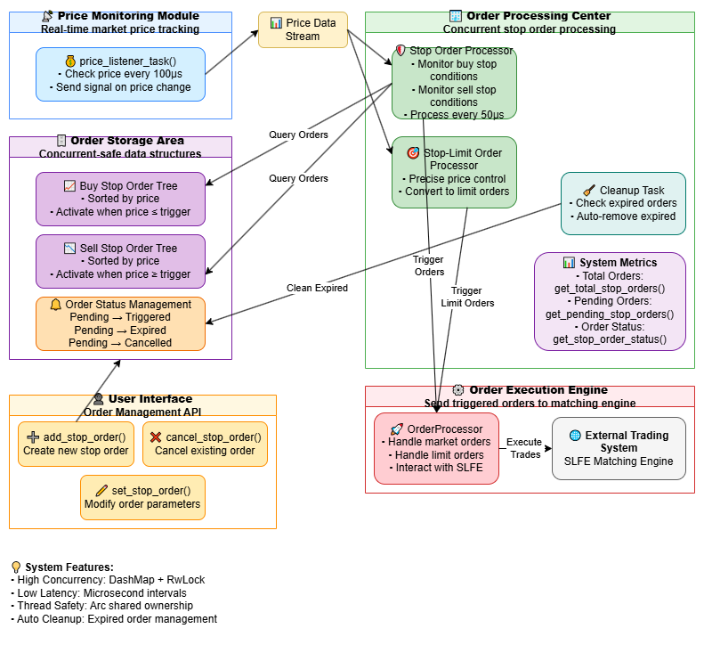

<h1 align="center">
    ✨ Luminengine
</h1>
<h4 align="center">
A high-performance financial quantitative trading order book matching framework.
</h4>
<p align="center">
  <a href="https://github.com/0xhappyboy/arbitrage/blob/main/LICENSE"></a>
</p>
<p align="center">
<a href="./README_zh-CN.md">简体中文</a> | <a href="./README.md">English</a>
</p>

## 📚 Directory

| **directory**        | **role**                             |
| :------------------- | :----------------------------------- |
| **core**             | Order book engine core code.         |
| **manager-desktop**  | Order Book Engine Desktop Manager.   |
| **emulator-desktop** | Desktop order book engine simulator. |
| **server**           | Engine service command line program. |
| **terminal**         | Command line terminal visualizer     |
| **builder/rpc**      | RPC protocol file builder.           |

## Supported Order Types

| **OrderType**        | **progress** |
| :------------------- | :----------- |
| **Limit Order**      | ✅           |
| **Market Order**     | ✅           |
| **GTC Order**        | ✅           |
| **IOC Order**        | ✅           |
| **FOK Order**        | ✅           |
| **Stop Order**       | ✅           |
| **Stop Limit Order** | ✅           |
| **Iceberg Order**    | ✅           |
| **Day Order**        | ✅           |

## Order Types

### Market Order

#### Market Order Buy Direction

```math
\begin{aligned}
&\text{Let } M_{\text{buy}} = \text{total market buy orders} \\
&\text{Let } P_{\text{ask}} = [p_1, p_2, \dots, p_n] \text{sell ​​order prices in ascending order} \\
&\text{Let } Q_{\text{ask}}(p_i) = \text{ in price } p_i \text{total sell orders} \\
\\
&\text{For } i = 1 \text{ to } n: \\
&\quad \text{If } M_{\text{buy}} \leq 0: \text{ break} \\
&\quad \text{MatchQty} = \min(M_{\text{buy}}, Q_{\text{ask}}(p_i)) \\
&\quad \text{Execute trade at price } p_i \text{ with quantity MatchQty} \\
&\quad M_{\text{buy}} = M_{\text{buy}} - \text{MatchQty} \\
&\quad Q_{\text{ask}}(p_i) = Q_{\text{ask}}(p_i) - \text{MatchQty}
\end{aligned}
```

#### Market Order Sell Direction

```math
\begin{aligned}
&\text{Let } M_{\text{sell}} = \text{total market sell orders} \\
&\text{Let } P_{\text{bid}} = [p_1, p_2, \dots, p_n] \text{buy order prices in descending order} \\
&\text{Let } Q_{\text{bid}}(p_i) = \text{in ptice} p_i \text{total buy orders} \\
\\
&\text{For } i = 1 \text{ to } n: \\
&\quad \text{If } M_{\text{sell}} \leq 0: \text{ break} \\
&\quad \text{MatchQty} = \min(M_{\text{sell}}, Q_{\text{bid}}(p_i)) \\
&\quad \text{Execute trade at price } p_i \text{ with quantity MatchQty} \\
&\quad M_{\text{sell}} = M_{\text{sell}} - \text{MatchQty} \\
&\quad Q_{\text{bid}}(p_i) = Q_{\text{bid}}(p_i) - \text{MatchQty}
\end{aligned}
```

#### Average transaction price calculation

```math
\text{AvgPrice} = \frac{\sum_{i=1}^{k} (p_i \times q_i)}{\sum_{i=1}^{k} q_i}
```

### Price Manager



### Iceberg Manager


## Resource

- <a href="https://github.com/0xhappyboy/luminengine/tree/main/builder/rpc/protos">RPC Proto File</a>
