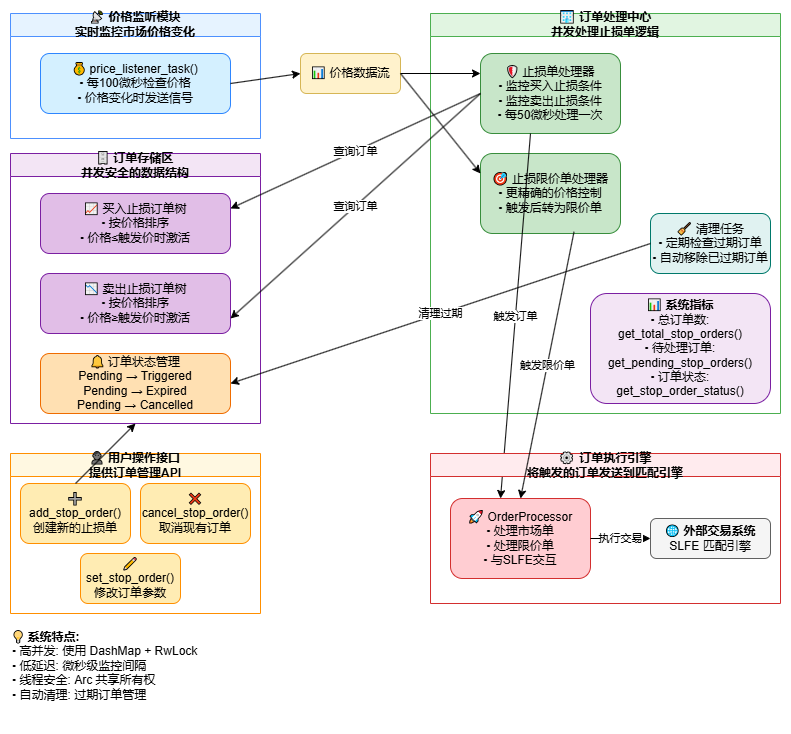
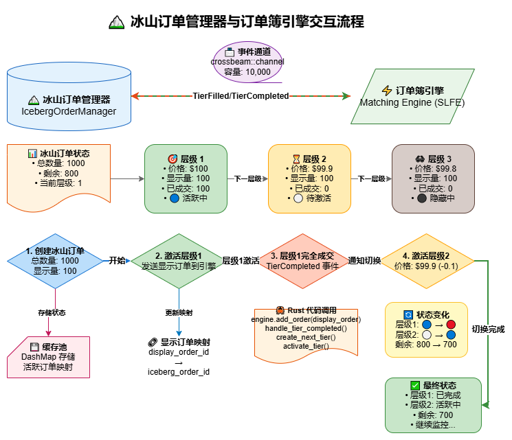

<h1 align="center">
    ✨ Luminengine
</h1>
<h4 align="center">
高性能订单簿撮合引擎.
</h4>
<p align="center">
  <a href="https://github.com/0xhappyboy/arbitrage/blob/main/LICENSE"></a>
</p>
<p align="center">
<a href="./README_zh-CN.md">简体中文</a> | <a href="./README.md">English</a>
</p>

## 📚 Directory

| **目录**             | **角色**                |
| :------------------- | :---------------------- |
| **core**             | 订单簿引擎核心代码.     |
| **manager-desktop**  | 订单簿引擎桌面端管理器. |
| **emulator-desktop** | 桌面端模拟器.           |
| **server**           | 引擎服务命令行程序.     |
| **terminal**         | 命令行终端可视化工具.   |
| **builder/rpc**      | RPC 协议文件生成器.     |

## 支持订单类型

| **订单类型**     | **进度** |
| :--------------- | :------- |
| **限价单**       | ✅       |
| **市价单**       | ✅       |
| **GTC 订单**     | ✅       |
| **IOC 订单**     | ✅       |
| **FOK 订单**     | ✅       |
| **市价停止订单** | ✅       |
| **限价停止订单** | ✅       |
| **冰山订单**     | ✅       |
| **Day 订单**     | ✅       |

## 订单类型

### 市价单

#### 买方向的市价单

```math
\begin{aligned}
&\text{Let } M_{\text{buy}} = \text{total market buy orders} \\
&\text{Let } P_{\text{ask}} = [p_1, p_2, \dots, p_n] \text{sell ​​order prices in ascending order} \\
&\text{Let } Q_{\text{ask}}(p_i) = \text{ in price } p_i \text{total sell orders} \\
\\
&\text{For } i = 1 \text{ to } n: \\
&\quad \text{If } M_{\text{buy}} \leq 0: \text{ break} \\
&\quad \text{MatchQty} = \min(M_{\text{buy}}, Q_{\text{ask}}(p_i)) \\
&\quad \text{Execute trade at price } p_i \text{ with quantity MatchQty} \\
&\quad M_{\text{buy}} = M_{\text{buy}} - \text{MatchQty} \\
&\quad Q_{\text{ask}}(p_i) = Q_{\text{ask}}(p_i) - \text{MatchQty}
\end{aligned}
```

#### 卖方向的市价单

```math
\begin{aligned}
&\text{Let } M_{\text{sell}} = \text{total market sell orders} \\
&\text{Let } P_{\text{bid}} = [p_1, p_2, \dots, p_n] \text{buy order prices in descending order} \\
&\text{Let } Q_{\text{bid}}(p_i) = \text{in ptice} p_i \text{total buy orders} \\
\\
&\text{For } i = 1 \text{ to } n: \\
&\quad \text{If } M_{\text{sell}} \leq 0: \text{ break} \\
&\quad \text{MatchQty} = \min(M_{\text{sell}}, Q_{\text{bid}}(p_i)) \\
&\quad \text{Execute trade at price } p_i \text{ with quantity MatchQty} \\
&\quad M_{\text{sell}} = M_{\text{sell}} - \text{MatchQty} \\
&\quad Q_{\text{bid}}(p_i) = Q_{\text{bid}}(p_i) - \text{MatchQty}
\end{aligned}
```

#### 平均成交价计算

```math
\text{AvgPrice} = \frac{\sum_{i=1}^{k} (p_i \times q_i)}{\sum_{i=1}^{k} q_i}
```

### 价格管理器



### 冰山订单管理器



## 资源

- <a href="https://github.com/0xhappyboy/luminengine/tree/main/builder/rpc/protos">RPC Proto 文件</a>
